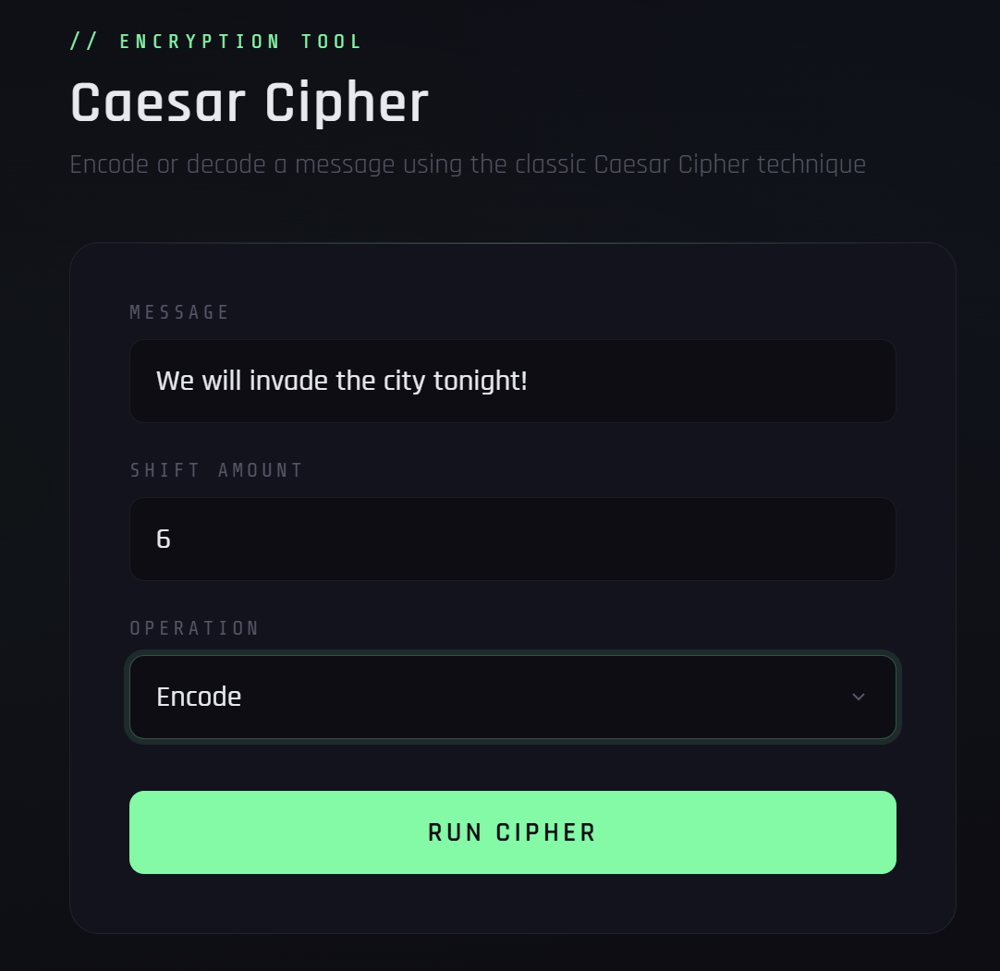
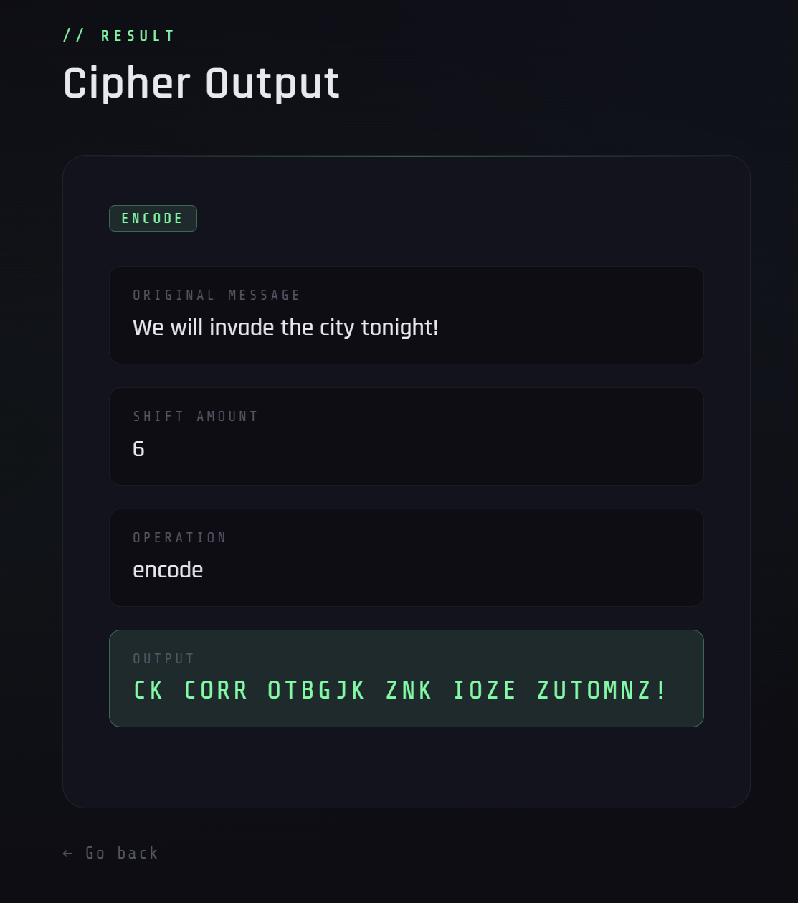
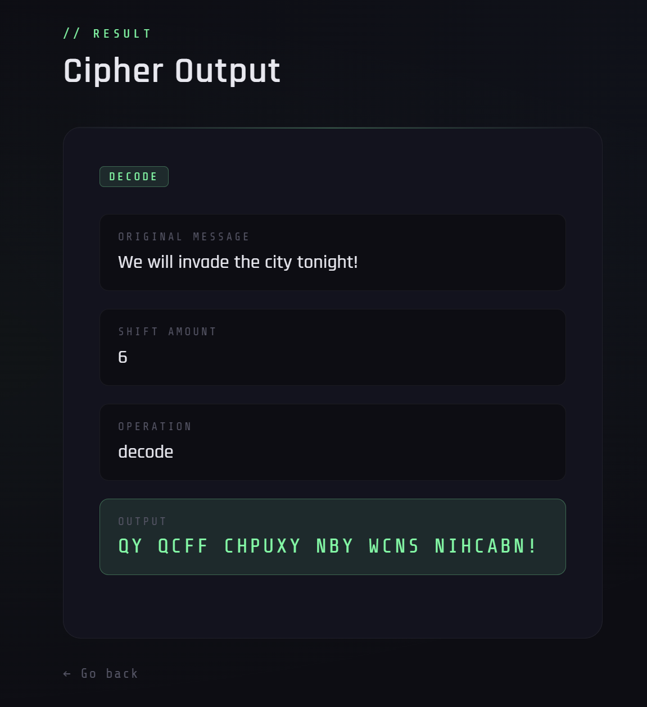

# Caesar Cipher Encoder/Decoder

A Python web application that encodes and decodes messages using the classic Caesar Cipher encryption technique. Built with Flask for the backend and styled with a custom dark mode cybersecurity-themed UI.

Built as part of my cybersecurity learning journey as a first-year CIS student at Cal Poly Pomona.

---

## Screenshots

**Home Page**


**Encoding a Message**


**Decoding a Message**


---

## Features

- Encode any message using a custom shift amount
- Decode any previously encoded message
- Handles spaces and special characters gracefully
- Clean dark mode web UI with cybersecurity aesthetic
- Modular architecture — logic and web server are separated into different files

---

## Technologies Used

- **Python 3** — Core programming language
- **Flask** — Python web framework for routing and serving pages
- **Jinja2** — Flask's built-in templating engine for passing Python data to HTML
- **HTML** — Form structure and page layout
- **CSS** — Custom dark mode styling with Google Fonts

---

## How It Works

1. User enters a message, shift amount, and chooses encode or decode
2. The HTML form sends the data to Flask using a POST request
3. Flask receives the form data in `app.py` and calls either `encode()` or `decode()` from `caesar_cipher.py` based on user choice.
4. The logic shifts each letter in the message by the shift amount using modulo arithmetic to handle wrap-around. It also uses a list containing alphabet letters.
5. Flask passes the result to `results.html` using Jinja2 templating
6. The results page displays the original message, shift amount, operation, and output

**The core cipher formula:**
```
Encode: new_index = (alphabet.index(letter) + shift) % 26
Decode: new_index = (alphabet.index(letter) - shift) % 26
```
The `% 26` ensures letters wrap around correctly — for example shifting `Z` by 3 gives `C` instead of going out of bounds.

---

## How to Run

1. Make sure Python 3 is installed on your machine
2. Install Flask:
```
   pip install flask
```
3. Clone this repository:
```
   git clone https://github.com/z76hxtzzms-cmyk/caesar-cipher.git
```
4. Navigate into the project folder:
```
   cd caesar-cipher
```
5. Run the Flask app:
```
   python app.py
```
6. Open your browser and go to:
```
   http://127.0.0.1:5000
```
7. Or run the command line version directly:
```
   python caesar_cipher.py
```

---

## Project Structure
```
caesar-cipher/
│── caesar_cipher.py     # Core logic — encode and decode functions
│── app.py               # Flask web server and route handling
│── templates/
│   │── index.html       # Home page with encoder/decoder form
│   │── results.html     # Results page displaying cipher output
│── static/
│   │── style.css        # Dark mode cybersecurity UI styling
│── README.md
│── screenshots/
│   │── index.png
│   │── encode.png
│   │── decode.png
```

---

## What I Learned

- I mainly learned how to download and install flask, how to properly use it and document
my steps correctly, and what each commands does through hands on implementations.
- How Jinja2 templating works by passing Python variables directly into HTML using `{{ variable }}` syntax which makes things WAY easier!
- How POST works by sending data to the object body instead of URL
- How HTML forms send data to a backend server using the `name` attribute

---

## AI Assistance

The core Python logic in `caesar_cipher.py` was written entirely by me through knowledge of how the cipher works from classes I took. Converting them into functions was also done by me through prior knowledge in Java. The Flask routing was done by me with the help of online tutorials, Google, and Claude AI. The overall design (CSS and HTML) was mostly done with AI, with it doing a large amount of work to ensure a slick overall visual layout. To showcase that I actually understood what was happening rather than just simply copying and pasting, I went through debugging sessions, commented what I learned, and left comments throughout the code to showcase understanding.


---

## Future Improvements

- [ ] Add support for lowercase letters without converting to uppercase
- [ ] Add a brute force decoder that tries all 25 possible shifts
- [ ] Deploy to the web or make it a simple desktop application